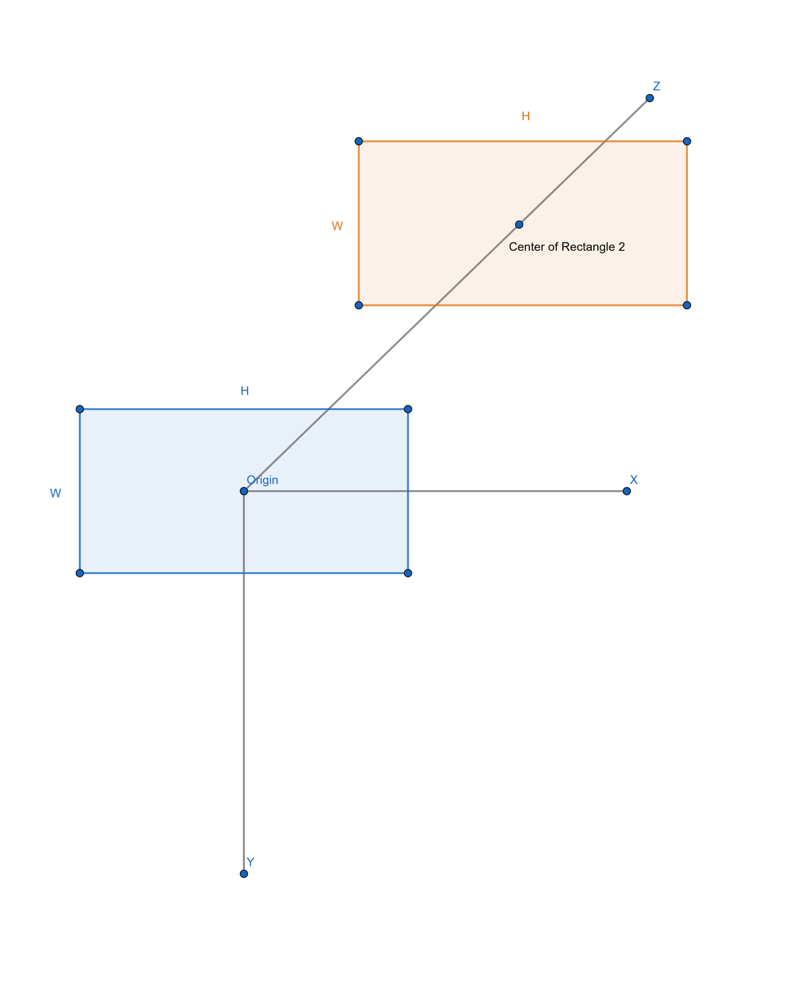
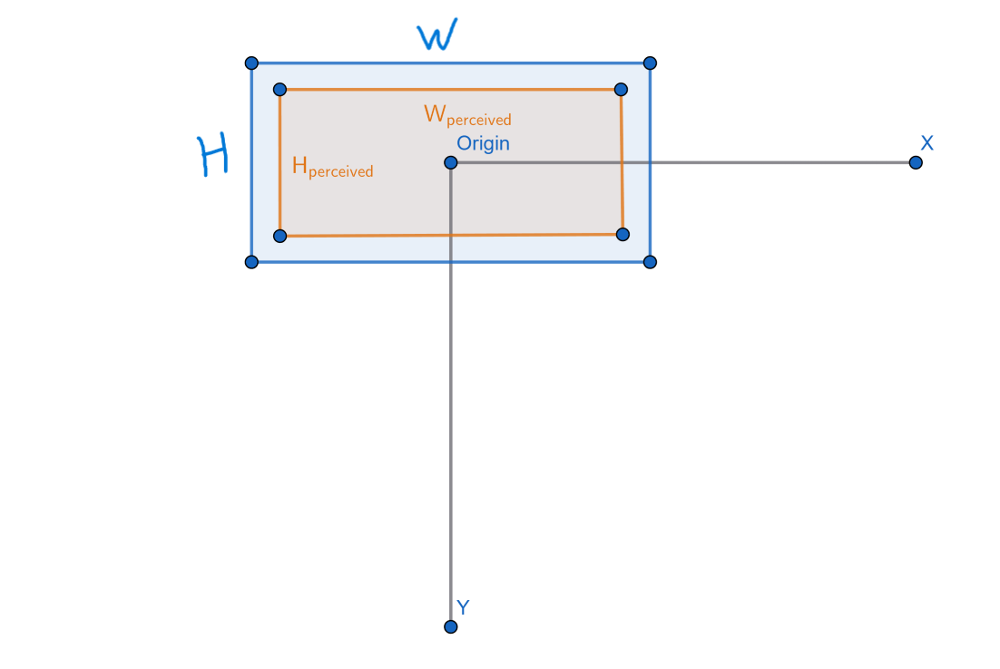
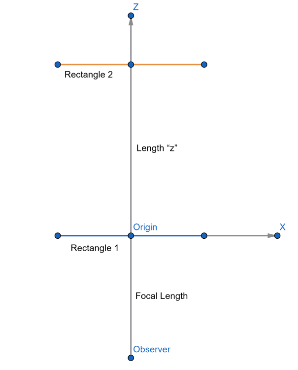
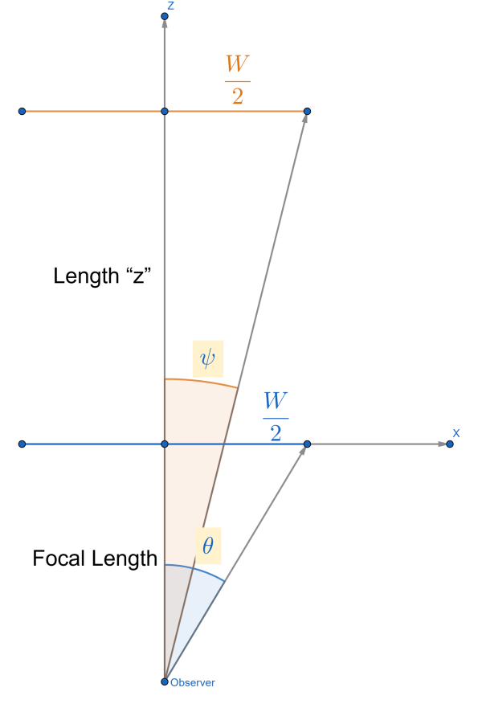

# Requirements
Requires a pip install of pygame and opencv-python

# Background
This was a demo that I put together in an attempt to understand the basic maths needed to project 3D objects onto a 2D screen with appropriate dimension-scaling to give the rendered image a realistic 3D perspective.
The point was to try to code a good enough program without looking up any literature on the subject, simply as a fun project for mental stimulation.

I have since studied some literature about 3D projections and found the proper approach to do this with linear algebra and 4x4 matrices and 4x1 vectors. The thing about that approach, however, is that it's great for full 3D rendering of 3D objects that can rotate, translate, and be scaled. For what I am doing here, where the objects don't scale, don't rotate, and only translate along the Z-axis, matrix math would be overkill. Thus, I think this approach is still perfectly suitable for pygame.

In this readme, I try to explain my thought process on how to derive the pygame code to do the math for 3D perspective dimension scaling. There might be some errors here and there, as it's not like anyone has peer-reviewed this, but I think that the effect that it creates on a 2D surface is good enough! To follow along, I assume that the reader has a basic understanding of algebra and trigonometry, such as:

**Tangent of an angle**:

$tan(\theta)=\frac{\text{Opposite side}}{\text{adjacent side}}$

**Inverse tangent to find an angle**:

$tan^{-1}(\frac{\text{Opposite side}}{Adjacent side}) = arctan(\frac{\text{Opposite side}}{Adjacent side})=\theta$

# Basics of 3D Perspective
## The basic setup
I thought about this with the following approach. Say I have 2 rectangles, each of which have a width "W" and a height "H" (so they have the same dimensions). As this is pygame, the X-axis is along the width direction, and the Y-axis is along the height direction, with the theoretical Z-axis going into the screen. One rectangle is placed at Z=0, and another some distance "z" away (Z=z). The following image describes this, with the blue rectangle at Z=0, and the orange rectanlge at Z=z. Both of their geometric centers (their centroids) lie on the Z-axis. This image is an orthographic, meaning that the axes retain their parallelism regardless of where they appear on the screen, thus not a realistic 3D perspective.

Intuitively, in a realistic 3D perspective, if an observer sees these rectangles from a position close to the blue rectangle, then the orange rectangle will appear to be smaller than the blue -- its perceived dimensions will be smaller, even though in reality it has the exact same dimensions as the blue rectangle. The following image shows what an observer might see if they are looking down the Z-axis. The main goal will be to calculate the perceived dimensions as a function of the distance from the observer. Notice in this image that the Z-axis disappears, because we are looking straight down the axis.

I don't want to approach this the same way as other sources that show you 3-dimensional representations to arrive at the perspective-transformation 4x4 matrix; I wanted to develop an intuitive understanding using basic geometry, so that's what I try to explain here.

## Top-Down View for X-dimensions
To get started, let's imagine that we are above the scene looking down on it. The following image shows what we might see. The point labeled "Observer" is our eye or focal-point that we use to perceive the 3D scenario, and the point labeled "Origin" lies on the screen of the computer, and we to the computer as the "sensor" onto which all other objects need to have their dimensions projected. Notice in this image that we can see the X and Z axes, but not the Y-axis, since we are looking down along the Y-axis. That is also the reason that the rectangles now appear only as lines, since we are looking down above them.

Knowing the scene, we want a way to calculate the perceived dimensions of both rectangles.

### Angle representation from observer to rectangle edges
With this scenario, we start to establish some geometry as the foundation of the calculations. The following image sets up the basic calculations, with the following definitions:
1) Angle from the observer's focal point to the right edge of the first rectangle, with the Z-axis being on angle 0: $\theta$
2) Angle from the observer's focal point to the right edge of the second rectangle, with the Z-axis being on angle 0: $\psi$
3) Distance from the observer's focal point to the "sensor", also the distance to the first rectangle: "Focal length"
4) Distance from the first rectangle to the second rectangle: "z"
5) Distance from the Z-axis to the right edge of either rectangle: $\frac{W}{2}$

### Calculating the angles
To find the two angles in question, we just need to use basic algebra and triginometry. We remember that the tangent of an angle is equal to the side opposite of the angle divided by the side adjacent to the angle.
For the sake of clarity, I will label the "Focal Length" distance as "L"
The angle from the observer to the right edge of the first rectangle is given by:

$tan(\theta)=\frac{W/2}{L}$

$\theta=arctan\frac{W/2}{L}$

And the angle from the observer to the right edge of the second rectangle is given by:

$tan(\psi)=\frac{W/2}{L+z}$

$\psi = arctan\frac{W/2}{L+z}$

### Projecting the angles of the perceived dimensions onto the screen
Now that we have the angles at which the observer perceived the edges of the rectangle at the two distances, it's time to project them onto the screen. We'll project the blue rectangle first since its position is already at the Z-position of the screen, and we'll find that its perceived dimension is exactly equal to its defined dimensions "W" and "H".

For the blue rectangle, we found that the angle from the Z-axis that the observer perceives its right edge is defined as:

$\theta = arctan(\frac{W/2}{L})$

The screen lies on the Z-position "L", since its distance from the observer is equal to the Focal Length. The question we must answer is, "Given that I know at what angle I perceive the right edge of the rectangle, and I know how far away the sensor (the screen) is that is displaying the rectangle, how wide am I perceiving the rectangle? Rather, at what X-position is its right edge?"
From this question, we have the following:

**Known**
1) The distance to the sensor (the screen) from my focal point:     $L$
2) The angle from the Z-axis that I percieve the right edge to be:     $\theta$

**Unknown**
1) The perceived X-position of the right edge:     $X$

We'll use the same trig function as before to solve this problem, and we'll reference our previous definition of theta.

$tan(\theta)=\frac{X}{L}$

$\text{From before:}\quad tan(\theta) = \frac{W/2}{L}$

$\text{Thus:}\quad \frac{X}{L}=\frac{W/2}{L}$

$\text{And finally:}\quad X = (W/2)\frac{L}{L} = W/2$

Thus, the perceived X-position of the right edge of the blue triangle is (W/2), which makes sense since the rectangle is on the screen Z-position to begin with, thus is not impacted by any projection.

Now let's find the perceived X-position of the orange rectangle, which is further away. Again, we want to know at what X-position we perceive its right edge at the Focal Length (L) distance from the observer:

$tan(\psi) = \frac{X}{L}$

$\text{From before:}\quad tan(\psi)=\frac{W/2}{L+z}$

$\text{Thus:}\quad \frac{X}{L}=\frac{W/2}{L+z}$

$\text{And finally:}\quad X = (W/2)\frac{L}{L+z}$

Let's try to intuitively think about what this final X says. If "z" is greater than 0 (meaning that the position is further away from the observer), the fraction $\frac{L}{L+z}$ will be less than 1. When you multiply a number that's less than 1 with another number (in our case, "W/2"), you'll get a number that is less than the original number. From a 3D perspective point of view, if the perceived dimension is less than "W/2", then it will appear smaller, which is exactly what we expect since the object is farther away. If "z" is less than 0 (a negative number), then the object will appear to be closer to the observer, and the fraction $\frac{L}{L+z}$ will result in a number greater than 1. Again, multiplying "W/2" by a number greater than 1 will result in a number that is larger than the original number, thus the object will appear to be larger.

If you're very forward thinking, you might be wondering what happens with this fraction if the "z" value is less than negative "L". In other words, what happens when the object is **behind** the observer? In this case, the fraction $\frac{L}{L+z}$ yields a negative number. When you multiply a negative number by the dimension "W/2", you'll get a negative number. Realistically, however, you cannot have a negative dimension for an object's width, since that doesn't make any sense. Thus, this equation breaks apart if you're trying to calculate the perceived dimension of an object that is behind the player, but you realistically would never need to do that. So you can ignore this!

# Conclusion
Finally, we have a simple formula to determine the perceived dimensions of an object as a function of its distance form the observer's focal point.

$\text{Perceived dimension}=\text{Actual dimension}\enspace \frac{\text{Focal length}}{\text{Focal length + Additional distance away from the observer}}$

You can get much more complex than this, but this is the simple rule to follow! You can think about velocity or movement with this same technique. If an object's velocity is 5 pixels per frame along the X-axis, it will appear to move slower than that if it is farther away and will appear to move faster than that if it is closer. So its display velocity can be manipulated by this same formula.

Thinking about Pygame code, you as the programmer would have to define the Focal Length that your program uses. You know that your screen's Z-position would technically always be at Z=Focal Length, and any objects that are farther away than the screen would need to have their Z-positions defined as Z = Focal Length + Additional distance.

